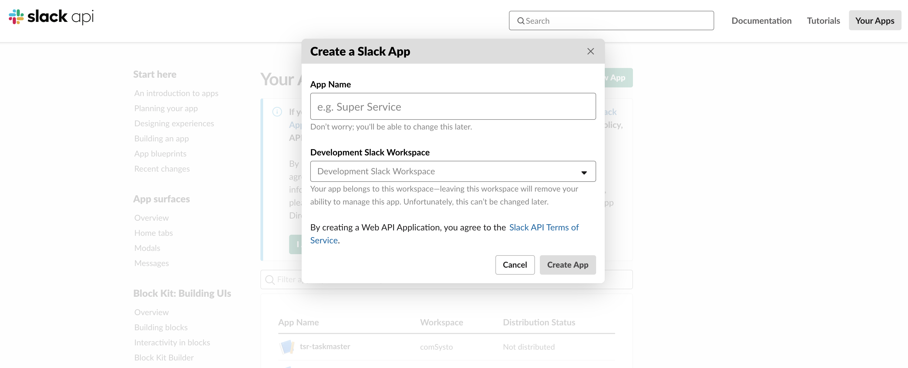
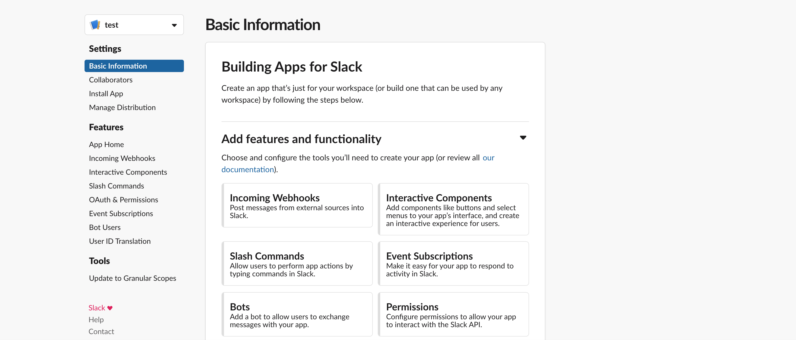
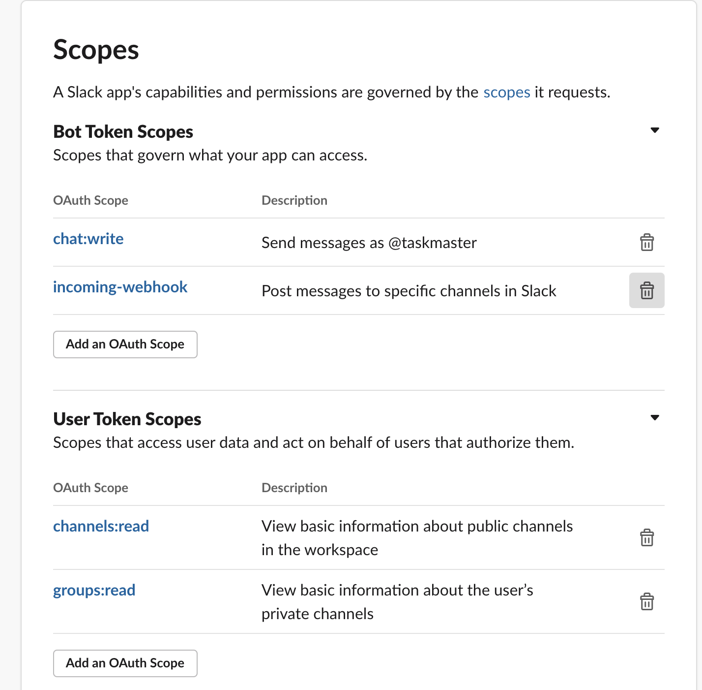
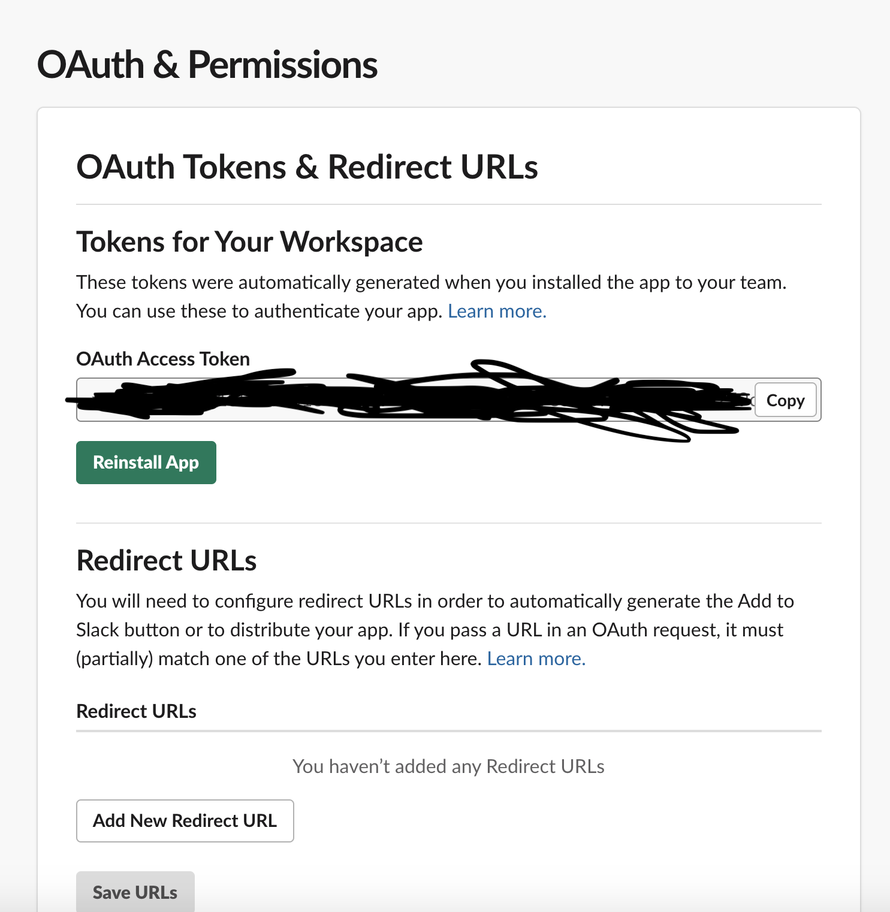

# taskmaster_slack_lambda
AWS Lambda Function variant for [Taskmaster Slack](https://github.com/fgakk/taskmaster_slack)

Taskmaster Slack lets you configure reminders for your team in a slack channel to be send daily (except weekends). Reminders will be rotated among your team so that every member will get their turn ;)

## How to add a custom app to your workspace

In order for taskmaster_slack to work you need to register a custom app to your workspace. First go to slack app directory [here](https://api.slack.com/apps) and click `Create New App` for registering a new app to your workspace.

 


Here you can give any name you like and more importantly the workspace of your organization.

After creating the app, permissions needs to be defined so that taskmaster server compant can receive a token with permission to get channel information and send message to channel.

Under Basic Information go to `Add features and functionality` and choose `Permissions`



You will redirected to `OAuth & Permissions` page where you need to define scope of your app. The scopes should look like the following:



After adding the required permission you can install the app by clicking `Install App to Workspace` on the same page.

With successful installation you can use OAuth access token to access slack api and do actions permitted via the OAuth Permission defined before. Use the bot token, since 
the bot user will send messages to slack.

Do not forget to add bot user to your channel.




## How to configure and deploy Taskmaster Lambda

Taskmaster Lambda requires a S3 bucket for its task configuration file. Currently it is called tasks.json and example of it can be found under
doc directory. So in order to create S3 and the IAM Role for Lambda service first deploy the cloudformation template under aws_init directory. While deploying
you are required to apply slack_api token as parameter. Refer to previous guideline on retrieving a token. 
This will create:
- S3 bucket called taskmaster-repo
- A secret under the secret manager containing Slack api token
- IAM Role for taskmaster, accessing cloudwatch logs and s3

After you have deploy init script, now you can deploy the template for the lamda itself. 
First compile typescript code with:
```
npm run build
```

This will put all compiled files and package.json under dist directory. In the template.yaml you need to change two options:

- SLACK_CHANNEL: Here you put your own channel
- Schedule: The default will send every week day at 4 am UTC message configured in tasks.json. 

I recommend to install AWS CAM CLI utility since it makes much easier to deploy a serverless application from command line or
IDE like IntellJ. Here you can find the instruction for installation of [SAM](https://docs.aws.amazon.com/serverless-application-model/latest/developerguide/serverless-sam-cli-install.html)

Run 
```
sam build -t template.yaml
```
from the root directory to build node app with modules. Afterwards you can deploy it via
```
sam deploy --guided
```

or you can just use Cloudformation UI ;)

## Setting up task configuration

Taskmaster uses a json formatted file to read task definitions. 
 
Task definitions are  configured like this:

```
[
    {
        "users": ["slackuserId1","slackuserId2","slackuserId3"],
        "remainingUsers":["slackuserId1","slackuserId2"],
        "task":"Today you are responsible for kitchen",
        "assigneeCount":2
    },
    {
        "users": ["slackuserId1","slackuserId2","slackuserId3"],
        "remainingUsers":["slackuserId1"],
        "task":"Today you are our moderator for daily",
        "assigneeCount":1
    }
]

``` 

Field Name| Type | Description 
-----------|-------|----------
remainingUsers|array|list of users not assigned to a task yet. Formatted as json array
assigneeCount|int|number of people to assign to a task 
task|string|description of task to be sent as slack message
users|array|list of users, where task assignment will rotate. Formatted as json array 

- If you want to add/remove a user from your team just update users column
- Update assigneeCount to a assign a task to more than one person
- Do not modifty remainingUsers as the application itself will update it
- Update task column if you want to change the content of the slack message.
- For users always put the `slackID` not the username. You can see a users id on their profile.

## Current limitations

- All tasks have the same scheduled time, so you cannot configure different tasks with different schedule. So
- Schedeuler does not consider public holidays, so you can get spammed on your vacation :(


## Future improvements

- Support for different schedule tasks
- Provide a way to confiure tasks with an interface like slack commands or rest api
- Add capability to import list of public holidays for not spamming your team ;)


